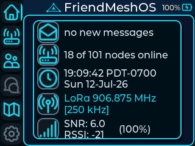
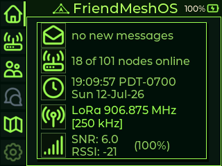
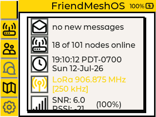
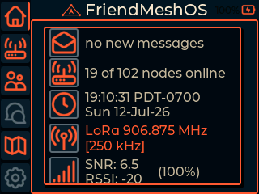
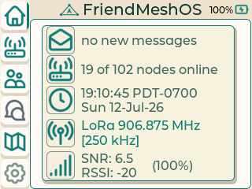
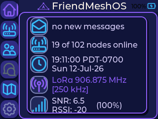

    

# FriendMeshOS

FriendMeshOS is experimental LilyGO T-Deck firmware built on Meshtastic
`v2.7.26.54e0d8d`. Its goal is a coherent handheld for off-grid mesh
communication, friend navigation, field utilities, and authorized passive RF
surveying.

The only current FriendMeshOS target is:

```bash
pio run -e t-deck-tft
```

Other inherited Meshtastic board definitions remain in the repository, but
they are not FriendMeshOS-supported targets and are not part of current UI or
hardware qualification.

## Current focus

- FriendMeshOS identity, startup splash, versioning, and attribution.
- Six dynamic T-Deck themes.
- **Theme #3: Clean Modern Field Tool** as the default theme.
- Preservation of ordinary Meshtastic messaging, positioning, and phone
  interoperability.
- Reliable SD-card BMP screenshot capture.
- Friend Compass only after the branding, theme, and compatibility gates pass.

See [FRIENDMESHOS_ROADMAP.md](FRIENDMESHOS_ROADMAP.md) for the execution plan
and [branding/TDECK_STYLING.md](branding/TDECK_STYLING.md) for the active visual
contract and known unfinished styling work.

## Themes

FriendMeshOS currently includes six T-Deck themes.

### Theme 1: Clean Modern

The default FriendMeshOS theme. It uses cyan accents, a near-black background,
clean borders, and a modern field-device layout focused on readability and
fast status scanning.



### Theme 2: Retro Terminal

A dark terminal-inspired theme using bright green accents and simplified
high-contrast styling. It is designed to feel like a compact field computer or
radio terminal.



### Theme 3: Neobrutalist

A bold, high-contrast theme using yellow, black, white, and thick borders. It
emphasizes strong visual separation, large interface shapes, and direct,
unpolished utility.



### Theme 4: Orbital Mission

A dark mission-control-inspired theme using orange-red accents against a black
background. It gives the interface a technical aerospace and operations-console
appearance.



### Theme 5: Alpine Daylight

A light daytime theme using cream surfaces, teal accents, and dark teal text. It
is designed for comfortable outdoor and daylight use while preserving clear
status visibility.



### Theme 6: Friendly Mesh

A colorful dark theme using violet, blue, and purple accents. It gives
FriendMeshOS a more approachable and playful identity while keeping navigation
and radio status information easy to distinguish.



Theme implementation remains under active development. Not every screen,
dialog, keyboard view, map state, icon, notification, or interaction state has
completed physical regression testing across all six themes.
## Screenshot command

FriendMeshOS supports saving the current T-Deck screen to the installed SD card
as a BMP image.

Use the following keyboard sequence:

```text
SYM + P > P
```

This means:

1. Press the `SYM + P` key combination.
2. Release the keys.
3. Press `P` again.
4. The second `P` press triggers the screenshot.

Screenshots are stored at the root of the SD card using filenames similar to:

```text
/screenshot_0001.bmp
/screenshot_0002.bmp
/screenshot_0003.bmp
```

BMP is used because it provides a reliable, low-overhead screenshot format on
the T-Deck. Screenshots can be converted to PNG or another format after copying
them to a computer.

Convert one BMP screenshot to PNG on macOS with:

```bash
sips -s format png screenshot_0001.bmp --out screenshot_0001.png
```

Batch-convert all BMP screenshots in the current directory with:

```bash
mkdir -p converted-png

for file in *.bmp; do
  sips -s format png "$file" \
    --out "converted-png/${file%.bmp}.png"
done
```

## Branding assets

Regenerate the T-Deck splash and embedded mark with Pillow installed:

```bash
python3 branding/generate_friendmeshos_assets.py
pio run -e t-deck-tft
```

The build copies `branding/logo_320x240.png` into the T-Deck LittleFS image as
`/boot/logo.png`.

## Build and upload

Build FriendMeshOS with:

```bash
pio run -e t-deck-tft
```

Upload FriendMeshOS to the connected T-Deck with:

```bash
pio run \
  -e t-deck-tft \
  -t upload \
  --upload-port /dev/cu.usbmodem806599BB8F8C1
```

The serial device path may be different on another computer or after the
T-Deck is disconnected and reconnected.

## Serial monitoring

Monitor the connected T-Deck at `115200` baud with:

```bash
pio device monitor \
  --port /dev/cu.usbmodem806599BB8F8C1 \
  --baud 115200
```

Press `Ctrl+C` to exit the serial monitor.

## Project status

This is development firmware. A successful build does not establish that the
following have passed physical regression testing:

- Startup splash
- Every theme and theme state
- Touch input
- Keyboard input
- Trackball input
- Screenshot capture on every screen
- SD-card behavior
- GPS behavior
- Bluetooth behavior
- LoRa behavior
- Phone interoperability
- Maps and offline map tiles
- Friend Compass behavior

Consult the roadmap milestone log for current implementation and testing
evidence.

## Upstream and licensing

FriendMeshOS remains based on and interoperable with the Meshtastic firmware
project. Meshtastic protocol identifiers and required attribution are retained.

The repository remains subject to its GPL-3.0 license and applicable vendored
third-party notices.

Friend Compass is inspired by the friend-navigation product category and does
not claim Totem Compass protocol compatibility.

RF-survey work is limited to authorized passive observation in the normal field
build.
